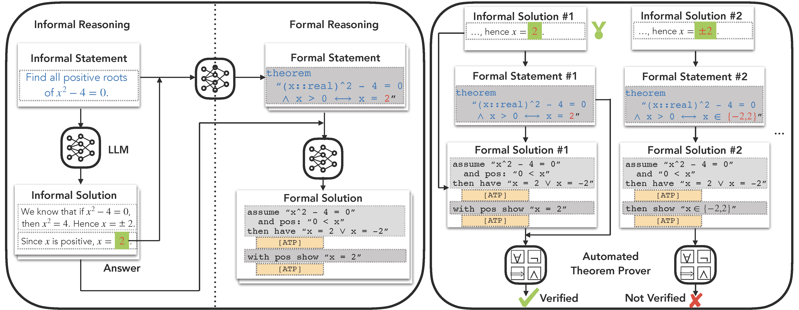

# Don't Trust: Verify -- Grounding LLM Quantitative Reasoning with Autoformalization

This is the official repo for

[**Don't Trust: Verify -- Grounding LLM Quantitative Reasoning with Autoformalization**](http://arxiv.org/abs/2403.18120) (ICLR 2024)

by Jin Peng Zhou, Charles Staats, Wenda Li, Christian Szegedy, Kilian Q Weinberger, Yuhuai Wu 



## Abstract
Large language models (LLM), such as Google's Minerva and OpenAI's GPT families, are becoming increasingly capable of solving mathematical quantitative reasoning problems. However, they still make unjustified logical and computational errors in their reasoning steps and answers. In this paper, we leverage the fact that if the training corpus of LLMs contained sufficiently many examples of formal mathematics (e.g. in Isabelle, a formal theorem proving environment), they can be prompted to translate i.e. autoformalize informal mathematical statements into formal Isabelle code --- which can be verified automatically for internal consistency. This provides a mechanism to automatically reject solutions whose formalized versions are inconsistent within themselves or with the formalized problem statement. We evaluate our method on GSM8K, MATH and MultiArith datasets and demonstrate that our approach provides a consistently better heuristic than vanilla majority voting --- the previously best method to identify correct answers, by more than 12% on GSM8K. In our experiments it improves results consistently across all datasets and LLM model sizes. 

## Prompts
All prompts used in the paper can be found in the `prompts` directory.

## Informal Solution Generation
Because Minerva is proprietary, we cannot release the exact code for generating informal solutions and autoforamlization. However, we provide an open source alternative script based on vLLM. The datasets should be first formatted in a jsonl format and the script can be run as follows:
```
python informal_prove.py
```
The script will output the informal solutions as well as majority voting accuracy. Note that for the subsequent steps, we only need to perform autoformalization on the problems where at least one informal solution is correct.

## Formal Statement Generation
We generate formal statements with the following script:
```
python formalize_statement.py
```
The prompts for formalizing statements are in the `prompts/formal_statement` directory.

## Formal Solution Generation
Formal solutions are generated with the following script:
```
python formalize_proof.py
```
The prompts for formalizing statements are in the `prompts/formal_solution` directory.

## Proof Checking
We use the [Isabelle](https://isabelle.in.tum.de/) proof environment and [PISA](https://github.com/albertqjiang/Portal-to-ISAbelle) interface to verify the statements and proofs. After installing them, put ``proof_checking_local.py`` under ``pisa/src/main/python/``.
Because proof checking is relatively slow but highly parallelizable, we can first chunk the formalized statements and proofs into smaller files:
```
python proof_checking_processing.py
```
and then run the proof checking script:
```
python proof_checking_local.py
```

## Citation
If you find this code useful in your research, please consider citing:
```
@inproceedings{zhou2023don,
  title={Don't Trust: Verify--Grounding LLM Quantitative Reasoning with Autoformalization},
  author={Zhou, Jin Peng and Staats, Charles E and Li, Wenda and Szegedy, Christian and Weinberger, Kilian Q and Wu, Yuhuai},
  booktitle={The Twelfth International Conference on Learning Representations},
  year={2023}
}
```
